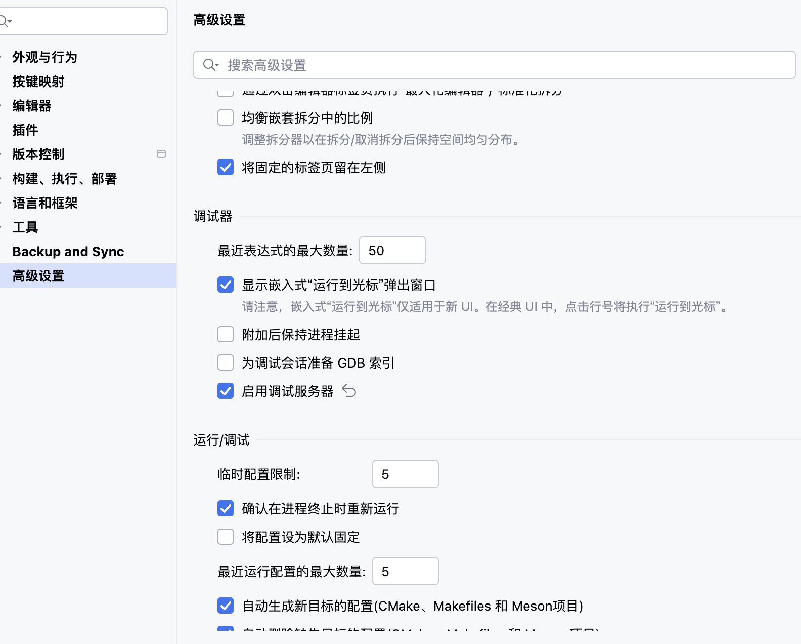

# MAC下开发stm32

关于mac下对stm32的开发，目前网络上能找到的资料不算太多，但是随着clion对于stm32的支持，其流程也十分简单，在创建项目之时，clion便会给出需要资料的下载内容。


可以看到，主要是下载stm32cubeMX和stm32CLT，CLT中基本涵盖了开发stm32所需要的主流工具，包括stlink、编译器、调试器之类的。
且图片中也有着具体的过程。

mac中clion默认使用的是clion自带的编译器和lldb，经过尝试也可以正常使用，如果没法使用，可以直接更换成为CLT中的，具体在**构建、运行、部署->工具链**中进行更改，更改之后记得要去工具链下面的CMake处同步更改。

CLT的包，如果没有更改安装位置的话，在根目录的opt文件夹中，该文件夹默认是隐藏的，需要自己手动前往。


在根据图片中的过程，完成创建之后，stm32的项目已经完成创建，需要注意的是，要在clion中开启调试器。在**高级设置->运行/调试->启用调试服务器。**



完成之后，clion目前也已经添加了stlink和jlink的支持，可以直接使用。如果使用的是daplink，目前还是需要通过openocd，可以看看我另一个仓库，关于标准库下mac开发stm32.

之后自己添加文件的时候，还是注意cmake文件的更改：
```cmake
# Link directories setup
target_link_directories(${CMAKE_PROJECT_NAME} PRIVATE
    # Add user defined library search paths
)

# Add sources to executable
target_sources(${CMAKE_PROJECT_NAME} PRIVATE
    # Add user sources here
)

# Add include paths
target_include_directories(${CMAKE_PROJECT_NAME} PRIVATE
    # Add user defined include paths
)

# Add project symbols (macros)
target_compile_definitions(${CMAKE_PROJECT_NAME} PRIVATE
    # Add user defined symbols
)

# Add linked libraries
target_link_libraries(${CMAKE_PROJECT_NAME}
    stm32cubemx

    # Add user defined libraries
)
```
cmake文件中的注释已经表明了需要更改的地方，比起之前的文件，确实方便不少。

**最后需要注意的地方：**目前默认没有生成hex或者bin文件，所以建议手动在cmake文件中，添加最后这两句，用于生成对应的文件：

```cmake
# Convert output to hex and binary
add_custom_command(TARGET ${CMAKE_PROJECT_NAME} POST_BUILD
        COMMAND ${CMAKE_OBJCOPY} -O ihex $<TARGET_FILE:${CMAKE_PROJECT_NAME}> ${CMAKE_PROJECT_NAME}.hex
)

# Convert to bin file -> add conditional check?
add_custom_command(TARGET ${CMAKE_PROJECT_NAME} POST_BUILD
        COMMAND ${CMAKE_OBJCOPY} -O binary $<TARGET_FILE:${CMAKE_PROJECT_NAME}> ${CMAKE_PROJECT_NAME}.bin
)
```